## Press Kit

This README file, all of the sceenshots, and the Medical ID Record app icon are downloadable
[here](https://github.com/hacknicity/MedicalIDRecord-PressKit/archive/main.zip).
The archive also includes versions of screenshots without device frames.

If you want to quickly create some data within the app you can import the sample data that was used in these screenshots.
See the [Sample Data](#sample-data) section below for more information.

### What is Medical ID Record?
Medical ID Record is an app for iPhone, iPad and Apple Watch for storing your medical information and emergency contacts.
This is a useful reference when visiting a healthcare professional and could be life-saving in case of emergency.

### Core Features
- **Personal Data**
Basic personal details: name, birthdate, blood type, height, and weight.
Record whether you are diabetic, suffer from epilepsy, or are an organ donor.

- **Medical Information**
Information categorized under Medical Conditions, Medical Notes, Allergies  & Reactions, Medications.
Other Notes category for anything else.

- **Attachments**
Add photo or PDF attachments to medical information entries.
Import from iCloud Drive, Dropbox etc. or drag and drop from other apps on iPad.
Scan documents to create PDF attachments.
Markup photo or PDFs to annotate, highlight or redact information.

- **Emergency Contacts**
Name, phone number and relationship of contacts.
Tap a contact to phone them.

- **Widgets**
Highly-customizable widgets on iOS/iPadOS 14 for viewing parts of your Medical ID record.
A pre-iOS 14 widget is also available.

- **Watch App**
Text is synced to the Watch app (photos and PDFs are not included).
Supports all Complication types.
Tap an emergency contact to call them.

- **Back Up / Restore**
Back up data for safekeeping or to copy it between devices.

- **Sharing**
Share some or all of your data by mail or iMessage.
Print or save to iCloud Drive, Dropbox etc.
Drag and drop to other apps on iPad.

- **Accessibility**
Dynamic Type, dark mode, Voice Over, and Voice Control.

- **Privacy**
Medical ID information is not shared with Apple's Health app or with any other apps or services.
Content is hidden in the Task Switcher snapshot image.
The app does not collect any usage metrics.

---
## Hero Images
#### Widgets

	

---
## iPhone Screenshots

#### View Medical ID:

<table style="border-spacing:12">
	<tr>
		<td>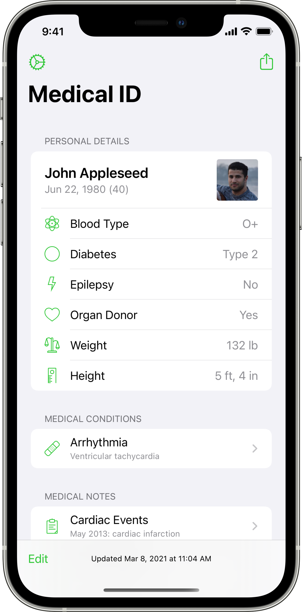</td>
		<td></td>
	</tr>
</table>

<table style="border-spacing:12">
	<tr>
		<td></td>
		<td>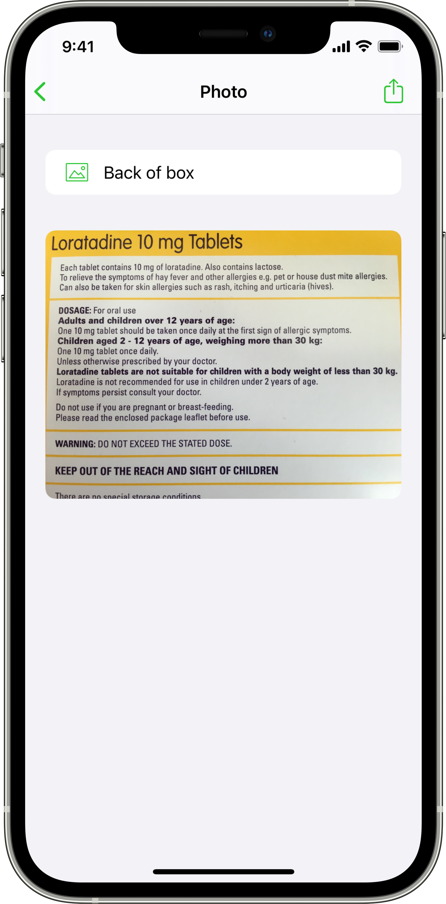</td>
	</tr>
</table>
 

#### Edit Medical ID:

<table style="border-spacing:12">
	<tr>
		<td></td>
		<td>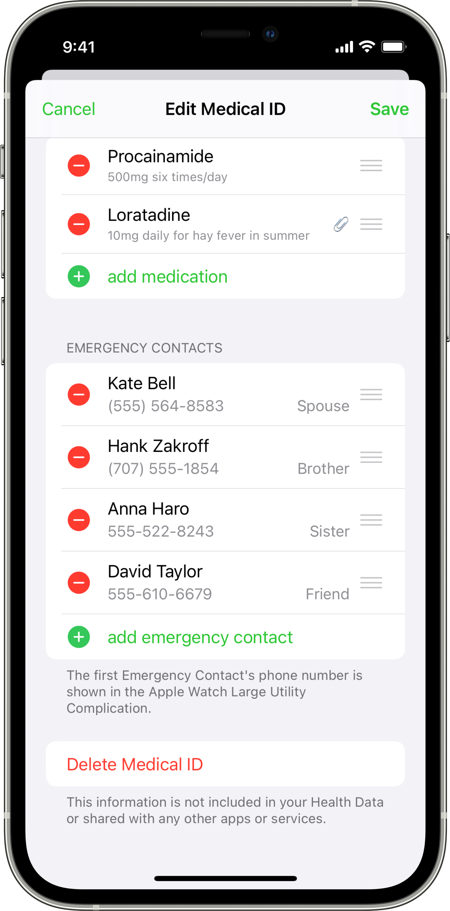</td>
	</tr>
</table>

<table style="border-spacing:12">
	<tr>
		<td></td>
	</tr>
</table>
 

#### Back Up, and Restore Medical ID:

<table style="border-spacing:12">
	<tr>
		<td></td>
		<td>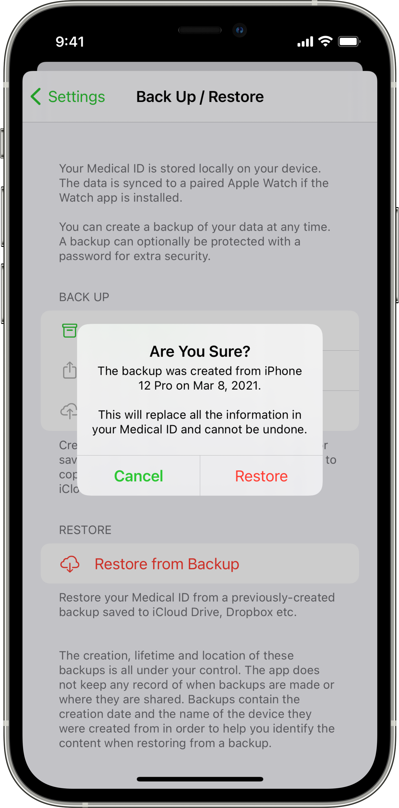</td>
	</tr>
</table>
 

#### Share Medical ID:

<table style="border-spacing:12">
	<tr>
		<td>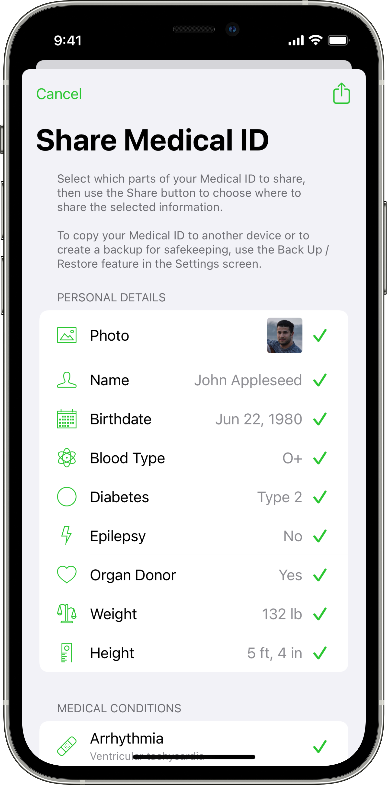</td>
	</tr>
</table>
 

#### iOS 14 Widgets (new in v6.0):

<table style="border-spacing:12">
	<tr>
		<td></td>
		<td></td>
	</tr>
</table>

<table style="border-spacing:12">
	<tr>
		<td></td>
		<td></td>
	</tr>
</table>

<table style="border-spacing:12">
	<tr>
		<td></td>
		<td></td>
	</tr>
</table>

<table style="border-spacing:12">
	<tr>
		<td>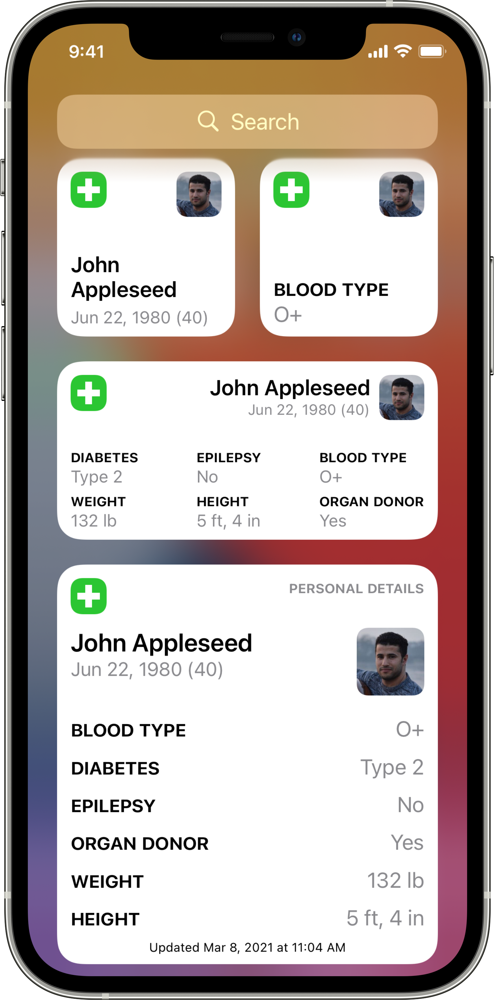</td>
		<td></td>
	</tr>
</table>

<table style="border-spacing:12">
	<tr>
		<td>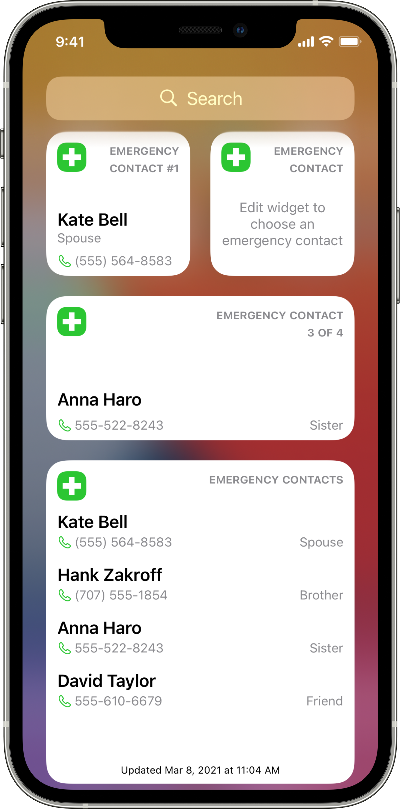</td>
	</tr>
</table>
 

#### Home Screen Quick Actions and Task Switcher Privacy:

<table style="border-spacing:12">
	<tr>
		<td></td>
		<td>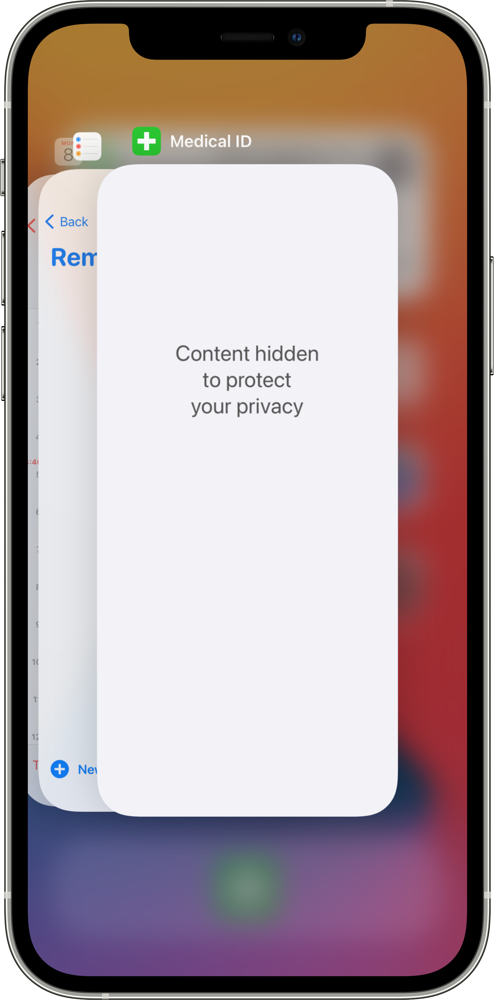</td>
	</tr>
</table>
 

#### Pre-iOS 14 Widget:

<table style="border-spacing:12">
	<tr>
		<td></td>
		<td></td>
	</tr>
</table>
 

---
## iPad Screenshots

#### View Medical ID:

<table style="border-spacing:12">
	<tr>
		<td></td>
		<td></td>
	</tr>
</table>

<table style="border-spacing:12">
	<tr>
		<td></td>
		<td></td>
	</tr>
</table>
 

#### Edit Medical ID:
<table style="border-spacing:12">
	<tr>
		<td>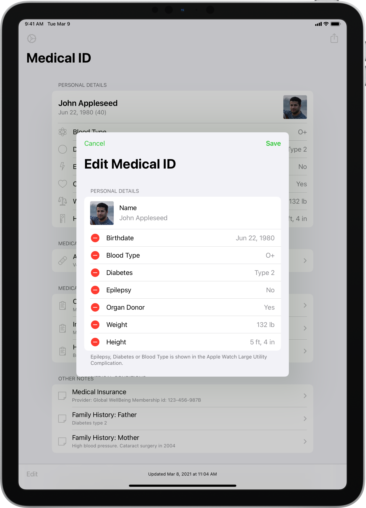</td>
		<td></td>
	</tr>
</table>

<table style="border-spacing:12">
	<tr>
		<td></td>
	</tr>
</table>
 

#### Back Up, and Restore Medical ID:

<table style="border-spacing:12">
	<tr>
		<td>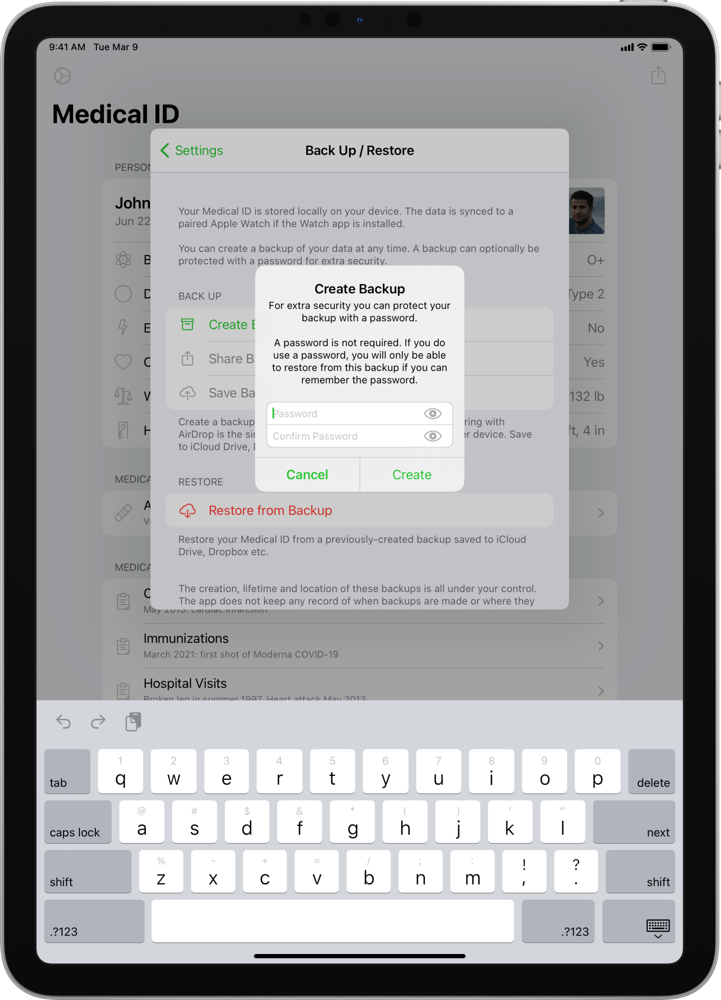</td>
		<td></td>
	</tr>
</table>
 

#### Share Medical ID:

<table style="border-spacing:12">
	<tr>
		<td></td>
	</tr>
</table>
 

#### iOS 14 Widgets (new in v6.0):

<table style="border-spacing:12">
	<tr>
		<td></td>
	</tr>
</table>

<table style="border-spacing:12">
	<tr>
		<td></td>
	</tr>
</table>

<table style="border-spacing:12">
	<tr>
		<td></td>
	</tr>
</table>

<table style="border-spacing:12">
	<tr>
		<td></td>
		<td></td>
	</tr>
</table>

<table style="border-spacing:12">
	<tr>
		<td></td>
		<td></td>
	</tr>
</table>
 

#### Pre-iOS 14 Widget:

<table style="border-spacing:12">
	<tr>
		<td></td>
		<td></td>
	</tr>
</table>

---
## Apple Watch Screenshots

#### View Medical ID:

<table style="border-spacing:12">
	<tr>
		<td></td>
		<td></td>
		<td>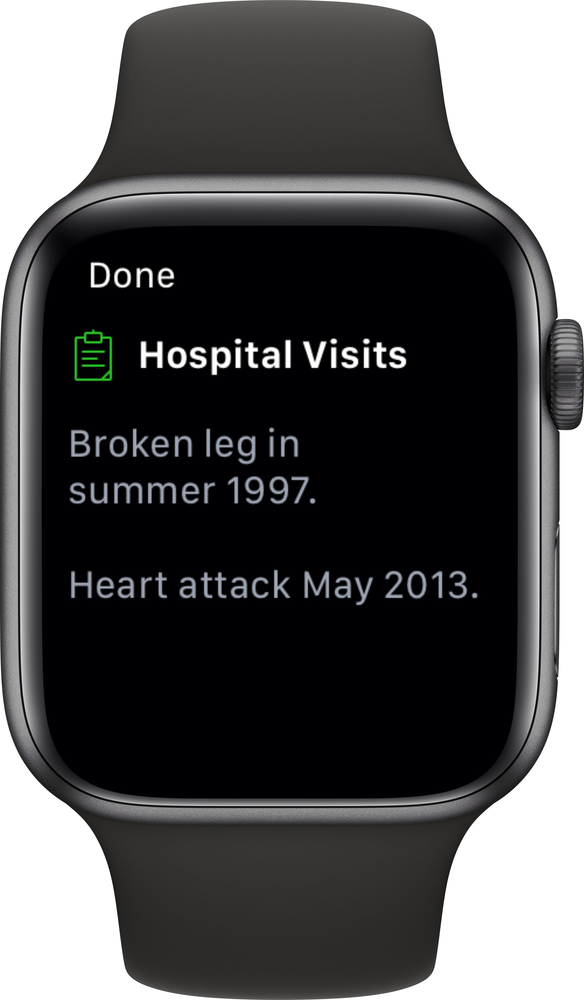</td>
		<td></td>
	</tr>
</table>

<table style="border-spacing:12">
	<tr>
		<td></td>
		<td></td>
		<td></td>
		<td></td>
	</tr>
</table>

---
## Sample Data
The file `SampleData.medicalidbackup` is a backup created from the app with some sample data.
This can be imported in to the app using the [Restore Medical ID](https://hacknicity.com/medicalid/userguide#restoremedicalid) feature.
You will need to copy the file somewhere that your device can access it (such as iCloud Drive or Dropbox).

Restoring from a backup will overwrite all data in the app.
If you have already created some data that you want to keep, you should first [create and save a backup](https://hacknicity.com/medicalid/userguide#backupmedicalid) of your own data.
You will then be able to restore your own data later.

---
## App Icon

	

---
## Key Details

### App Store URL
[https://itunes.apple.com/app/id994171337](https://itunes.apple.com/app/id994171337)

### Pricing
One-time purchase price of **$4.99 USD** or equivalent currency.
At the time of writing this is **£4.99 GBP** and **€5.49 EUR**.

### Availability
Medical ID Record is a universal app available worldwide for iPhone, iPad and Apple Watch and requires iOS 11 and watchOS 4 or later.
Some features require iOS/iPadOS 13 or 14.

### Web Sites
- [Home Page](https://hacknicity.com/medicalid)
- [User Guide](https://hacknicity.com/medicalid/userguide)
- [Version History](https://hacknicity.com/medicalid/versionhistory)
- [Privacy Policy](https://hacknicity.com/medicalid/privacypolicy)

### Original Release Date
June 25th, 2015.
There have been almost 40 updates over the years to add new features, support new devices and new technologies such as Apple Watch, iPad multitasking, and iOS 14 widgets.

### About Me
My name is **Geoff Hackworth**.
I'm a UK-based software engineer who has been developing software since getting a Commodore VIC-20 in the early 1980s.
I graduated in Computer Science in 1991 and have been developing software professionally ever since.

I've been building native iOS apps since 2011 (iOS 4) and have been an independent developer since 2014.
I share my development time between my own portfolio of apps and freelance client projects.

### Any Questions?
If you have any questions at all, please don't hesitate to contact me at [geoff@hacknicity.com](mailto:geoff@hacknicity.com) or on [Twitter](https://twitter.com/geoffhackworth).
